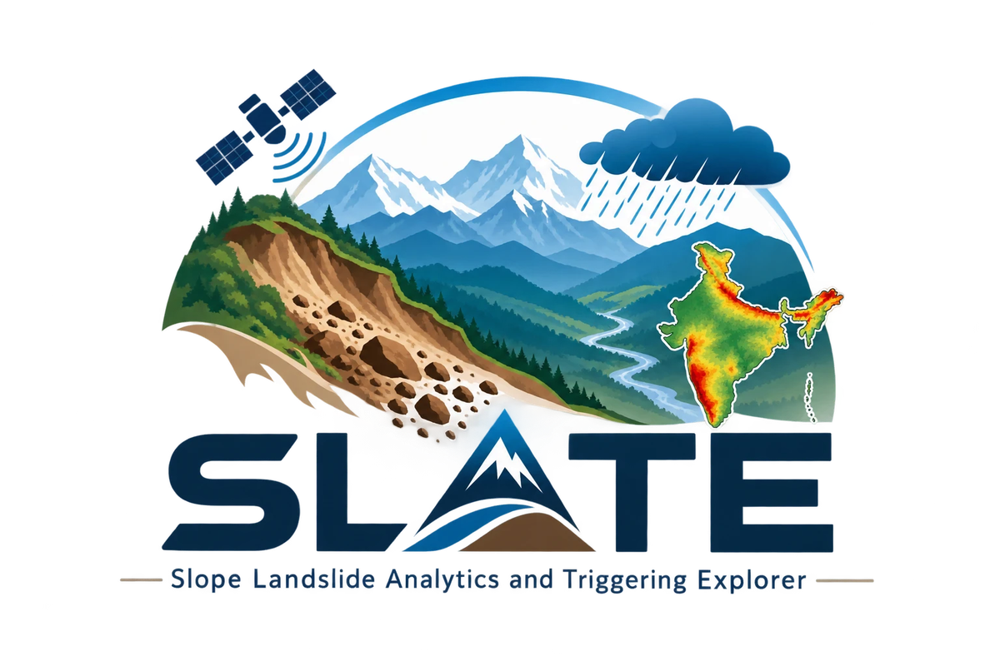

# SLATE: Slope Landslide Analytics and Triggering Explorer

<p align="center"></p>

[](https://doi.org/10.5281/zenodo.23068753)

**Open SLATE: https://slateindia.github.io**

SLATE is an interactive research platform for landslide susceptibility and rainfall-triggering analysis in India.
It maps national landslide susceptibility on a 0.05° grid and evaluates rainfall thresholds and machine-learning
nowcasts for any 0.25° rainfall cell and any day from 1991 to 2025, using India Meteorological Department gridded
rainfall. All computation runs in the browser; no installation or login is needed.

> Research model output. Not an official landslide warning.

## Documentation

- User manual and scientific background: in the app under *User manual*, or as [Markdown](docs/USER_MANUAL.md) and [PDF](docs/SLATE_User_Manual.pdf)
- [Model cards](docs/MODEL_CARD.md)
- [Scientific methods implemented](docs/SCIENTIFIC_METHODS.md)

## Data

The analysis data (harmonised landslide inventory, predictor table, susceptibility grids, predictions and validation
tables) are archived at https://doi.org/10.5281/zenodo.23069045. Input datasets come from the India Meteorological
Department, Copernicus GLO-90, SoilGrids 2.0, ESA WorldCover, WorldPop, GEM Global Active Faults, USGS ComCat, the
Generalized Geology of the World, the NASA Global Landslide Catalog and published event inventories, and remain subject
to their providers' terms.

## Run locally

```bash
cd frontend
npm install
npm run build
npm run preview      # then open http://localhost:3001
```

## Citation

Tiwari K (2026) SLATE: Slope Landslide Analytics and Triggering Explorer, version 1.0.0. Zenodo.
https://doi.org/10.5281/zenodo.23068753

## Licence and contact

Code: MIT licence (see `LICENSE`). Contact: Kishan Tiwari, kishantiwari@iitkgp.ac.in
